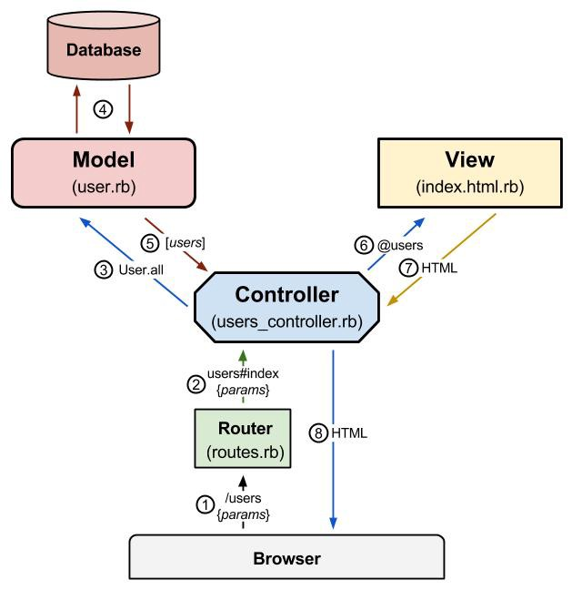
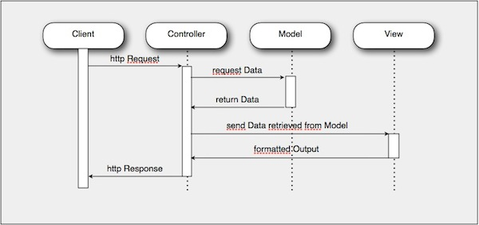

# Request-Response Cycle, Web Servers & Web Frameworks

## Objectives

1. Identify and describe the Request-Response Cycle
1. Identify and describe the Model View Controller convention
1. Define **Convention over Configuration**
1. Define the **Separation of Concerns**

## Initial Exercise

- **Think, Pair, Share** - Think up 5 conventions that exist in ordinary day-to-day life. Share your list with a partner. Why do we follow these conventions? What are alternatives? What if we didn't follow them what would happen?

#### Why?

Why do we have architectures like MVC? The answer is because they are conventions that make coding easier.

We could write all the code together in one file without spaces or new lines, the computer does not care, but that would be very hard for humans to work on.

Instead, we break up code into by **Concern** or area of functionality in order to simplify the process of writing web servers. This principle is called the **Separation of Concerns**. Basically "keep code together that do the same thing".

We want to always look for conventions to use, and be careful when we depart from conventions. We want to put **Convention over Configuration** - so that our code is standardized and recognizable by other developers.

## Two Conventions: MVC & The Request-Reponse Cycle

Code is instructions for a computer.

The web is a network of computers with two types of nodes in the network. Clients, that request and display data, and servers that request and respond with data (but do not display it).

Clients and servers request data and servers respond to requests to data using one process called the **Request-Response Cycle**. Examples of clients are browsers, apps, and IoT devices like the Amazon Echo. Examples of servers are any website or web service on the internet.

Servers, who request and respond to data, have various ways that they are organized, but we will be learning the most common pattern called **Model View Controller** or **MVC**.

* **Controllers** - Where code that defines routes, requests, and responses logic goes.
* **Views** - Where code goes that users see and interact with (HTML).
* **Model** - Where code goes that interfaces with a database.

Here is a diagram of an integrated look at the Request-Response Cycle and MVC:

## Resources

1. [Request Response Cycle Code Academy](https://www.codecademy.com/articles/request-response-cycle-static)
1. [What is Programming in MVC](https://www.youtube.com/watch?v=1IsL6g2ixak)

## Baseline Challenges

1. Work with a partner to come up with an analogy for the request response cycle or MVC and share it on slack.
1. Draw your own original picture of the Request Response Cycle and MVC.
1. Install [Emmet](https://emmet.io/) or another HTML snippet package to your text editor.
1. We're going to learn the web from the "outside-in" so from the views to the database. So start learning HTML/CSS doing the [Dash Tutorial](https://dash.generalassemb.ly/). (If you already know HTML/CSS just send a link to the instructor with an advanced HTML/CSS code sample that you wrote.)
