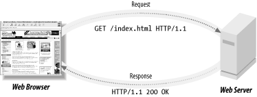

# URLs, HTTP, and REST

## Objectives

1. Identify and describe each part of a URL and HTTP Request.
1. Define and explain REST

## Initial Exercise

1. Write your home address out and diagram what each part is called.

## URLs

The web works with a series of unique addresses like the postal service. These addresses are called URLs or **Uniform Resource Locator**.

They are the most obvious part of any request to a server.

URLs have a distinct anatomy and as a web developer you MUST memorize each part of a url - just as if you were a postal worker, you'd need to know what a zip code was!

URLs are the surface level of any request to a web server. However, there is more information in a request.

To view more about a request use the Sources tab of your Chrome web tools. Load a web page and click XHS and then select the request you want to review.

## HTTP

HTTP is a protocol that you MUST use to send and receive requests. HTTP has **HTTP Verbs** and **HTTP Statuses** and you must MEMORIZE both.

HTTP Verbs are the following:

1. GET
1. POST
1. PUT
1. PATCH
1. DELETE

The most common HTTP statuses are the following. Here is a [complete list](https://httpstatuses.com):

* 200 - Success
* 400 - Bad request
* 401 - Unauthorized
* 404 - Not found
* 418 - [I'm a tea pot](https://httpstatuses.com/418)
* 500 - Internal Server Error

## REST

REST is a convention for web server behavior that you SHOULD use to follow web best practices.

* REpresentational
* State
* Transfer

## Resources

1. [What is HTTP?](https://www.youtube.com/watch?v=SzSXHv8RKdM)
1. [Explained HTTP, HTTPS, SSL/TLS](https://www.youtube.com/watch?v=po3zYOe00O4)
1. [REST Wikipedia Article](https://en.wikipedia.org/wiki/Representational_state_transfer)
1. [REST & HTTP](https://www.youtube.com/watch?v=LHJk_ISxHHc)
1. [Intro to REST](https://www.youtube.com/watch?v=YCcAE2SCQ6k)

## Baseline Challenges

1. Using the above resources answer these technical interview questions:
  1. List out the HTTP action verbs. Which ones make changes to the state, and which ones do not?
  1. What are HTTP response status codes? Which ones mean success and which failure?
  1. What is the difference between HTTP and HTTPS?
  1. What does REST stand for?
  1. What are the reasons to use a "RESTful" server?
1. Complete the [Giphy API Search Tutorial](https://www.makeschool.com/online-courses/tutorials/giphy-search-app-with-node-js/your-node-environment)
