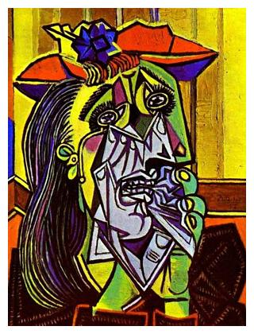

# Bootstrap Basics

## Objectives

1. Add bootstrap to any project.
1. Utilize bootstraps most basic css classes to define a conventional web design (grid, navbar, etc).
1. 

## Overview

Remember that Convention over Configuration is a way to gain in development speed, code reusability, and to cope with unexpected edge cases. Well we can use CoC on the front end as well as the back end. We will first be learning how to use Bootstrap to learn the conventions of web design, and then in future classes we will learn how to write completely custom CSS code. For now though, we just need things to look OK.

Much like Picasso who first mastered the traditional painting techniques before launching off to invent modern art.

### Early Picasso

### Late Picasso

## Resources

1. [Bootstrap](http://getbootstrap.com/)

## Baseline Challenges

1. Add bootstrap to your project using the CDN link.
1. Add the bootstrap navbar to your layout template.
1. Add the grid to your layout template and each template of your project.
1. Make sure your project is fully mobile responsive.
1. Add the bootstrap form/input helper classes to make your forms pretty.
1. Add bootstrap button classes to your buttons.
1. Use bootstrap's typographic helper classes to complete your project.
